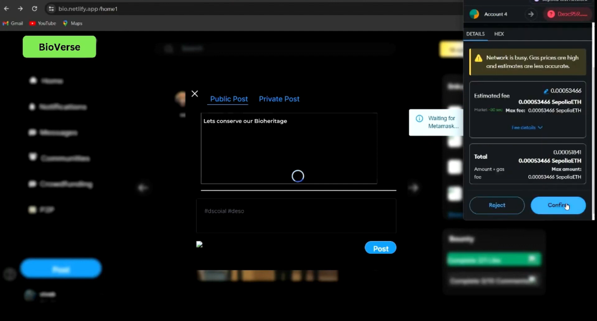
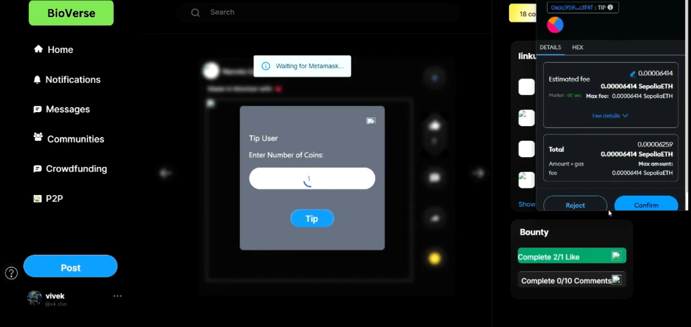
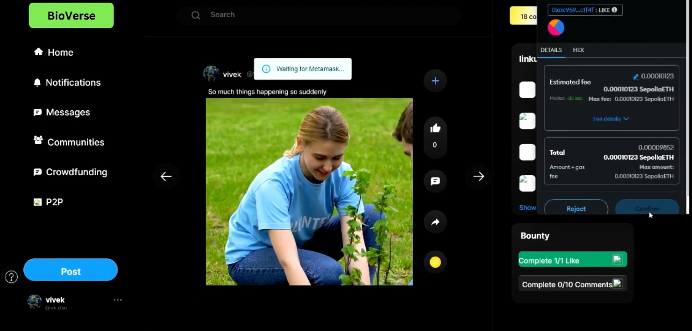
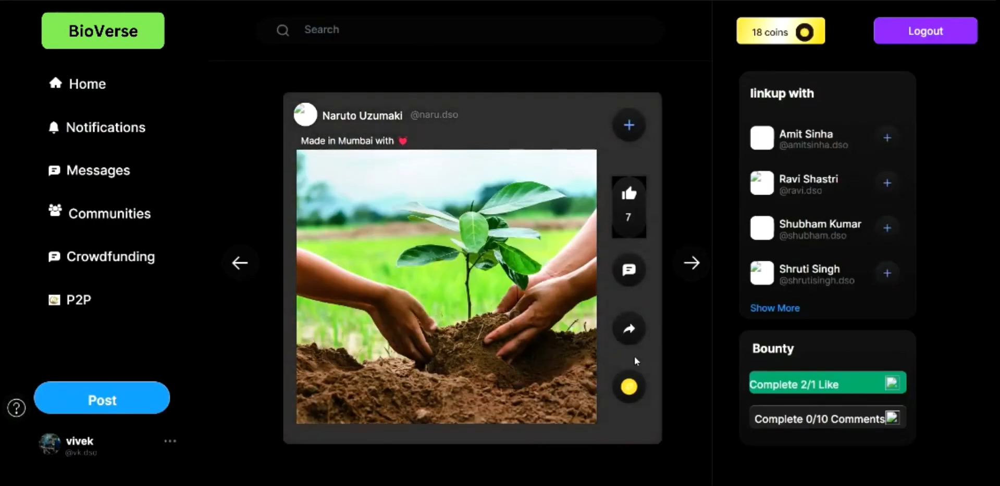
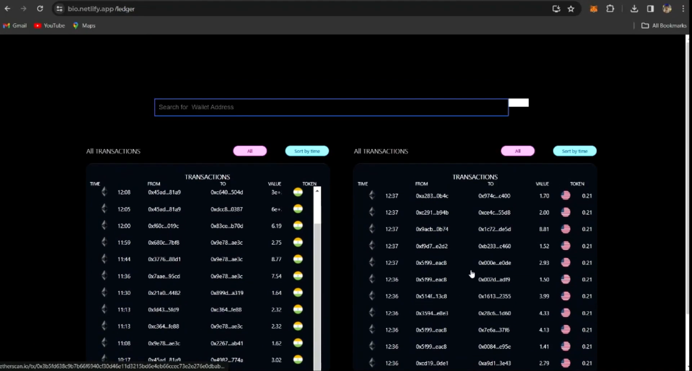
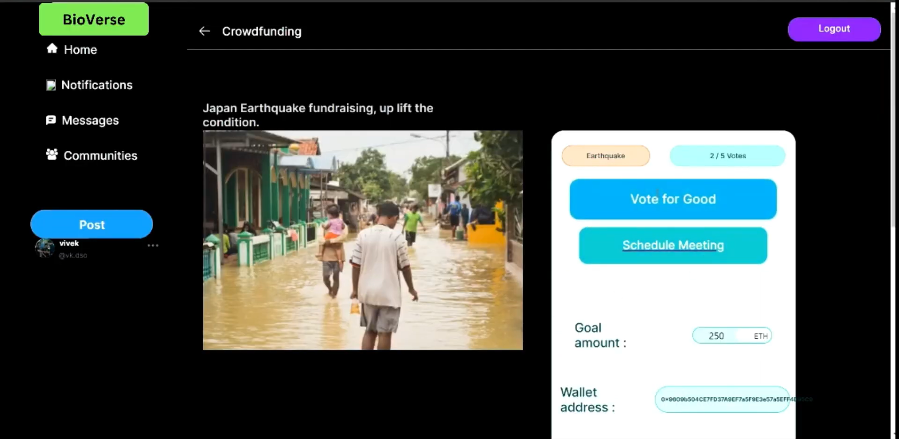
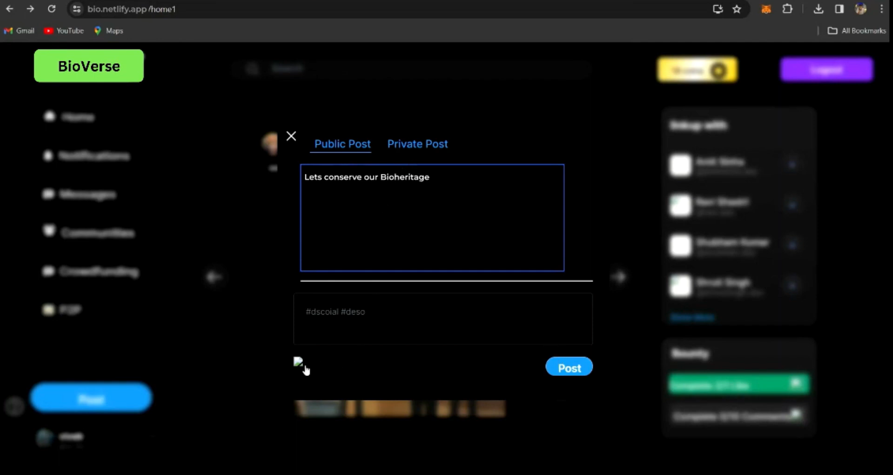

# BioVerse - Platform to Support BioHeritage

[Video Demo](https://youtu.be/0l_iaUcyJv0)  
[User Walkthrough](https://www.youtube.com/watch?v=NX7J4GHaBB0)

## A Step Towards Humanity

## Tokenomics Information

Deployed Smart Contract Address/ID on Stellar Testnet: `CB4H75Q634VCPFL7VSP57FANUOWF6R2GJ5B6UZVPP62CUDNAE25FUNTC`

Welcome to BioVerse, a decentralized platform where users can engage with each other, earn tokens, and participate in various activities. Before diving into the platform, it's essential to familiarize yourself with some core principles and features.

## Tech Stack
- Freighter Wallet
- Stellar
- Ethereum
- Smart Contracts
- HTML/CSS
- JavaScript
- React.js
- Solidity
- Polygon
- Soroban SDK
- Rust

## Soroban SDK
We utilized the Soroban SDK to develop the PolyFund smart contract for BioVerse, enabling efficient and secure fundraising for conservation projects. The contract includes features like setting funding targets, managing contributions, and ensuring transparency through contributor voting. Key functionalities include:

- **Initialization**: Setting up the funding manager, target amount, deadline, and minimum contribution.
- **Contribution Management**: Accepting funds from contributors and updating their balances.
- **Voting and Requests**: Allowing contributors to vote on fund requests and ensuring majority support for payments.
- **Refunds**: Providing refunds if the funding target is not met by the deadline.

Soroban SDK and Stellar (Freighter) wallet integration: Deployed Smart Contract on Stellar Testnet for post functionality.

## Features

### Product Screen Shots

